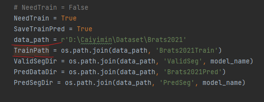

# SwinUnet3D
demo中最后一个字母为1的表示可以正常使用，为0的表示图像没有预处理好，效果很差，dice系数小于0.001 ，所有训练脚本都放在了demo文件夹中。

下载好对应的数据集之后，记得去Config类中把下图中的data_path和TrainPath改成自己的路径即可完成训练

如果我们的工作对您有用，请引用对应的论文：https://bmcmedinformdecismak.biomedcentral.com/articles/10.1186/s12911-023-02129-z
